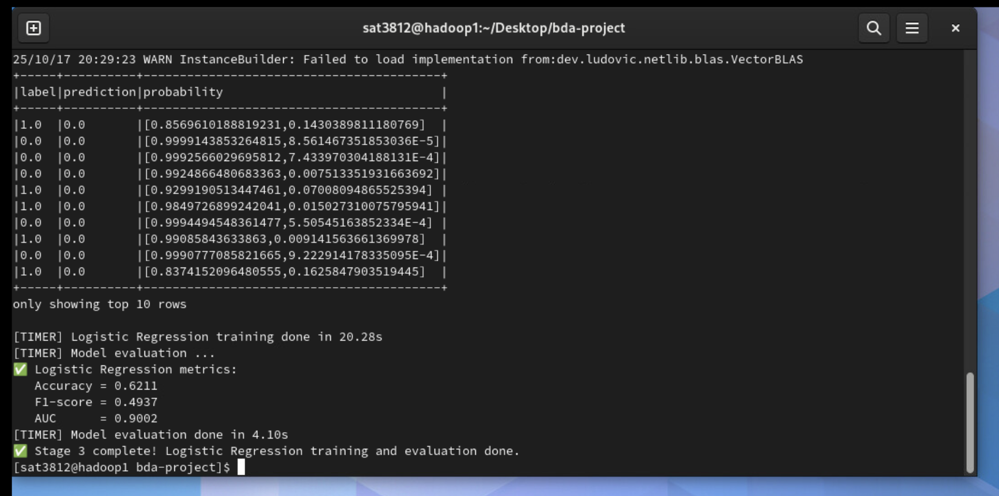
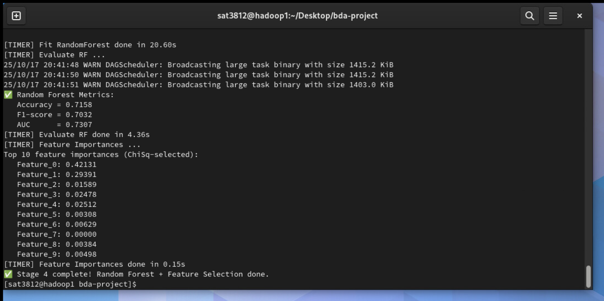

# Spark-Based Alzheimer’s Diagnosis from Clinical/Cognitive Tabular Data

## Overview
This project implements a **Spark-based pipeline** for early-stage diagnosis of Alzheimer’s disease (AD) using clinical and cognitive tabular data.  
The pipeline demonstrates distributed data preprocessing, statistical analysis, and model training across **single-node and multi-node** Spark clusters.

---

## Code Files
| File | Description |
|------|--------------|
| `01_preproc_numeric.py` | Numeric data preprocessing — load CSV, schema checks, deduplication, imputation, range validation |
| `02_preproc_categorical.py` | Categorical preprocessing — handle missing values, one-hot encoding, scaling, and feature assembly |
| `03_stats_and_lr.py` | Logistic Regression model training and evaluation with accuracy, F1-score, AUC metrics |
| `04_rf_and_feature_select.py` | Random Forest model with ChiSqSelector for top 50 features and feature importance analysis |
| `utils.py` | Utility functions for Spark session creation, timers, and logging |
| `run_pipeline.sh` | Shell script to execute all stages sequentially and report total runtime |

---

## Dataset
**Source:** [Kaggle - Alzheimer’s Disease Dataset](https://www.kaggle.com/datasets/rabieelkharoua/alzheimers-disease-dataset)  
**Records:** 2,149 rows  
**Features:** 34 columns (clinical + cognitive attributes)

---

## Spark Pipeline Workflow

### **Stage 1 – Numeric Preprocessing (Aakash)**
**Goal:** Clean and prepare numeric features.  
**Steps:**
1. Load CSV → Spark DataFrame.  
2. Drop duplicates (0.05 s).  
3. Check schema, data types, and null counts.  
4. Impute missing numeric values using **mean** strategy (Age, BMI, BP, Cholesterol, etc.).  
5. Perform basic range/outlier validation.  
6. Write cleaned table → `stage1_numeric`.

**Outcome:**  
Cleaned numeric dataset (2,149 records) ready for categorical preprocessing.

---

### **Stage 2 – Categorical Preprocessing (Gideon)**
**Goal:** Handle categorical data and assemble modeling features.  
**Steps:**
1. Load `stage1_numeric`.  
2. Fill categorical nulls (mode / “Unknown”) — done in 1.58 s.  
3. Identify numeric (13) and categorical (19) columns.  
4. Apply:
   - `StringIndexer` + `OneHotEncoder` on categorical variables.  
   - `StandardScaler` on numeric variables.  
5. Combine using `VectorAssembler`.  
6. Save as `stage2_featurestore`.

**Outcome:**  
Standardized, encoded feature store ready for modeling.

---

### **Stage 3 – Logistic Regression (Niraj)**
**Goal:** Binary classification of Alzheimer’s vs. non-Alzheimer’s using Spark ML.  
**Steps:**
1. Load `stage2_featurestore`.  
2. Descriptive statistics grouped by label:
   - Alzheimer’s: 760 cases  
   - Non-Alzheimer’s: 1,389 cases  
3. Train-test split (80/20).  
4. Evaluate using:
   - Accuracy = **0.6211**  
   - F1-Score = **0.4937**  
   - AUC = **0.9002**
## 📉 Logistic Regression Results


**Outcome:**  
High ROC-AUC demonstrates strong separation ability of early Alzheimer’s symptoms.

---

### **Stage 4 – Random Forest (Aditya)**
**Goal:** Ensemble modeling and feature importance.  
**Steps:**
1. Load `stage2_featurestore`.  
2. Apply Chi-Squared feature selection (Top 50).  
3. Train Random Forest (`numTrees=100`, `maxDepth=10`).  
4. Evaluate using Accuracy, F1, and AUC.  
5. Extract top predictive features for medical interpretation.

## 🌲 Random Forest Results


**Outcome:**  
Random Forest provided improved robustness and interpretability compared to Logistic Regression.

---

## Performance Comparison

| **Configuration** | **Workers** | **Stage 1 (Numeric)** | **Stage 2 (Categorical)** | **Stage 3 (LR)** | **Stage 4 (RF)** | **Total Time (s)** | **Total Time (min)** |
|--------------------|-------------|------------------------|---------------------------|------------------|------------------|--------------------|----------------------|
| **Single Node (Standalone)** | 1 | 82 s | 74 s | 64 s | 76 s | **296 s** | **4.93 min** |
| **Multi-Node (2 Workers)** | 2 | 105 s | 85 s | 31 s | 51 s | **272 s** | **4.53 min** |
| **Multi-Node (3 Workers)** | 3 | 88 s | 50 s | 27 s | 84 s | **249 s** | **4.15 min** |

---

## Screenshots
Include screenshots showing:
- Stage 1 & 2 preprocessing outputs  
- Stage 3 Logistic Regression results  
- Stage 4 Random Forest metrics  
- Spark Master Web UI (`http://hadoop1:8080`)  
- Multi-node worker connections (`hadoop2`, `hadoop3`)  
- Final runtime comparison (run_pipeline.sh output)

---

## Summary and Observations
- **Performance improved ~16%** when scaling from 1 node to 3 workers.  
- **Logistic Regression** achieved strong ROC-AUC (0.90), highlighting effective early classification.  
- **Random Forest** identified top cognitive and medical predictors, supporting better interpretability.  
- Demonstrates the scalability and power of **Apache Spark** for distributed medical data analysis.

---

## Technologies Used
- **Apache Spark 3.5.0**
- **PySpark (Python API)**
- **Hadoop 3.3.6 Cluster**
- **Scala 2.12, Java 21**
- **Linux Fedora (VM Environment)**

---

## Execution Instructions
1. Ensure Hadoop and Spark are configured on all nodes.  
2. Start cluster manually:
   ```bash
   /opt/spark/sbin/start-master.sh
   /opt/spark/sbin/start-worker.sh spark://<master-ip>:7077
